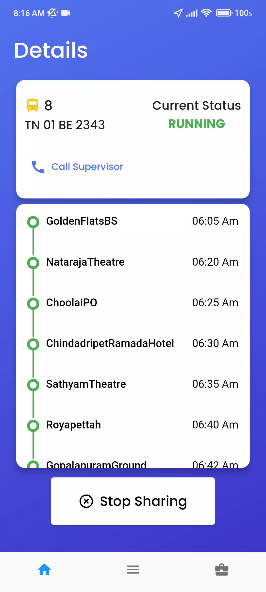
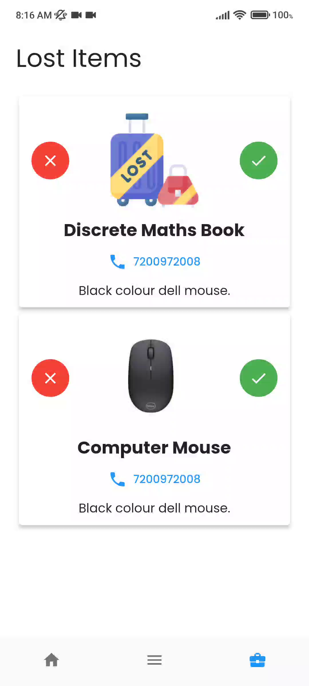
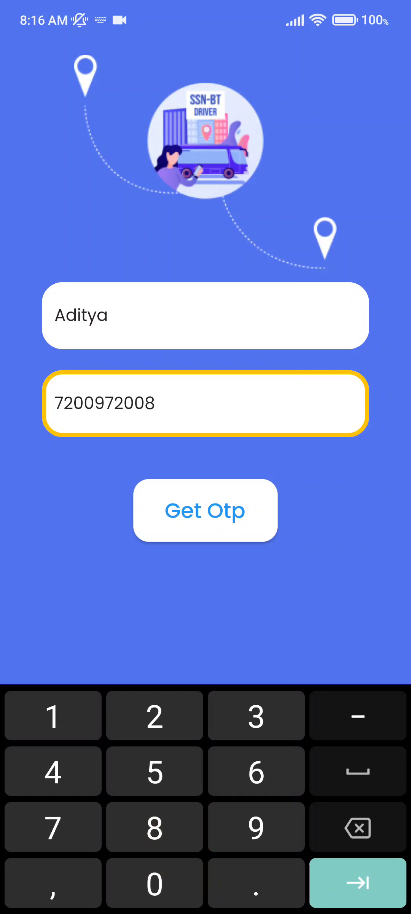

# 🚍 SSN Bus Tracking – Driver App

A cross-platform Flutter app enabling bus drivers and route supervisors at SSN College of Engineering to **share live locations**, **send route updates**, **notify breakdowns**, and manage **lost & found** requests for passengers.

> Companion application to the [SSN Bus Tracking – User App](https://github.com/adeeteya/Ssn-bt).

## 📦 Key Features

### 📡 Real-Time Location Sharing
- Share your current location with passengers on the assigned route.
- Start/Stop location sharing with a single tap.

### 🚨 Breakdown Notifications
- Notify all passengers of a breakdown in real time.
- Status auto-updates to `BREAKDOWN` until resolved.

### 🔁 Route Management
- Easily switch your assigned bus route in case of reassignment.
- Supports dynamic routing and multi-driver handling.

### 📋 Lost & Found Dashboard
- View, approve, or reject lost item reports submitted by students.
- Mark items as resolved to close the loop with the requester.

### 📊 Arrival Report Generation (Admin Only)
- Supervisors and admins can view and verify daily arrival time reports.

## 🧰 Tech Stack

| Component             | Tech Used                              |
|----------------------|-----------------------------------------|
| UI Framework         | Flutter (Dart)                          |
| Location Services    | Google Maps SDK, Location Package       |
| State Management     | GetX                                    |
| Authentication       | OTP-based login (Admin/Driver roles)    |
| Backend Services     | Firebase Realtime Database, Firestore   |
| Design & Prototyping | Figma                                   |

## 👥 User Roles & Access

| Role         | Capabilities                                                   |
|--------------|----------------------------------------------------------------|
| **Driver**   | Share location, notify breakdown, view & manage lost items     |
| **Admin**    | All driver permissions + access to arrival reports             |
| **Supervisor** | Manage drivers and assist in route reassignment              |

## 📱 Screenshots

| Screen | Preview |
|--------|---------|
| Home Screen |  |
| Lost Found Screen |  |
| Sign In Screen |  |
